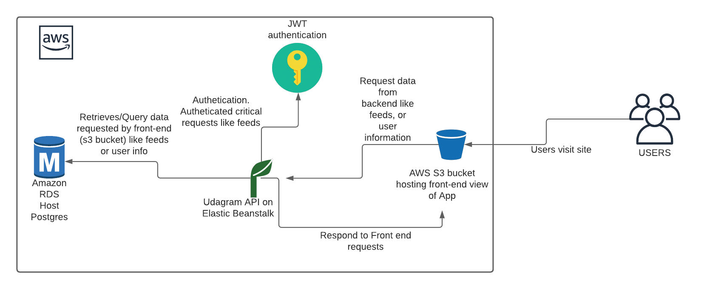

### INFRASTRUCTURE 
____
The infrastructure used in this project is made up of 4 key components/services all provided by [AWS](https://aws.amazon.com/). 
- RDS (Relational Database Service). Used to provide data persistence using the Postgresql database.
- Elastic beanstalk (EB). Used to service the backend api used the by front-end part of the application to perform
  requests. EB works hand-in-hand with RDS to perform requests made from front end.
- AWS S3 Bucket. Used to service the front-end view (or actual) site that users interact with. This is where operatrions
  like signin, signout, feeds request and others are made (originate from)
  
