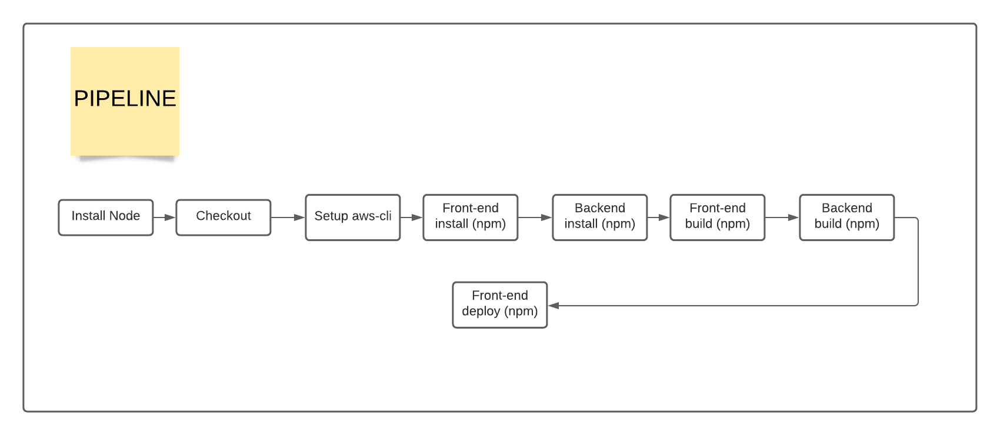
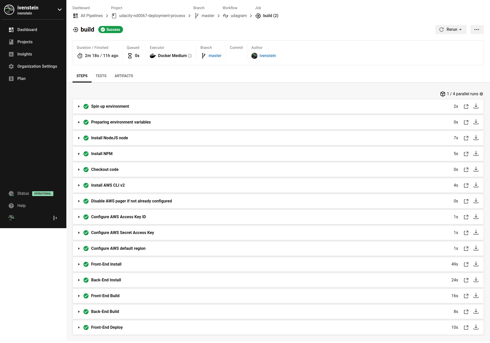

#### PIPE LINE
___
In this project (app), [circleci](https://circleci.com/) is used as the CI/CD platform. The various pipeline process is 
described below alongside with images

- Install node
- Setup aws-cli (used for deployment of the front-end to s3 bucket)
- Front-End Install (using `npm`)
- Back-End Install (using `npm`)
- Front-End Build (using `npm`)
- Back-End Build (using `npm`)
- Front-Deploy Build (using `npm`)

Here is a visual structure of the build

Here is a visual of a `success`ful pipeline run for the build job in circleci
